# Informações do Projeto
`TÍTULO DO PROJETO`  

 - Saideira 

`CURSO` 

 - Ciência da computação

## Participantes

 Os membros do grupo são:
 - Arthur Torres Lemos
 - Larissa Mariella da Silva Souza
 - Lucas Pereira Rangel de Carvalho

# Estrutura do Documento

- [Informações do Projeto](#informações-do-projeto)
  - [Participantes](#participantes)
- [Estrutura do Documento](#estrutura-do-documento)
- [Introdução](#introdução)
  - [Problema](#problema)
  - [Objetivos](#objetivos)
  - [Justificativa](#justificativa)
  - [Público-Alvo](#público-alvo)
- [Especificações do Projeto](#especificações-do-projeto)
  - [Personas, Empatia e Proposta de Valor](#personas-empatia-e-proposta-de-valor)
  - [Histórias de Usuários](#histórias-de-usuários)
  - [Requisitos](#requisitos)
    - [Requisitos Funcionais](#requisitos-funcionais)
    - [Requisitos não Funcionais](#requisitos-não-funcionais)
  - [Restrições](#restrições)
- [Projeto de Interface](#projeto-de-interface)
  - [User Flow](#user-flow)
  - [Wireframes](#wireframes)
- [Metodologia](#metodologia)
  - [Divisão de Papéis](#divisão-de-papéis)
  - [Ferramentas](#ferramentas)
  - [Controle de Versão](#controle-de-versão)
- [Projeto da Solução](#projeto-da-solução)
  - [Tecnologias Utilizadas](#tecnologias-utilizadas)
- [Referências](#referências)

# Introdução

 O alcoolismo é um problema de saúde pública que afeta milhões de pessoas em todo o mundo, incluindo o Brasil. De acordo com dados do Ministério da Saúde, o consumo de álcool está associado a diversas doenças, como cirrose hepática, câncer e transtornos mentais, além de ser um fator de risco para acidentes de trânsito e violência. 

 Diante desse cenário preocupante, é fundamental que sejam desenvolvidos projetos que abordem o problema do alcoolismo de forma abrangente e eficaz, promovendo o tratamento e a conscientização sobre os danos causados pelo uso excessivo de álcool. Neste contexto, o projeto "Saideira" tem como foco desenvolver ações voltadas para a prevenção do consumo de álcool e principalmente para o apoio às pessoas que sofrem ou já sofreram com a dependência química, contribuindo para a melhoria da qualidade de vida geral de tais indivíduos.

## Problema

  O problema a ser abordado no projeto "Saideira" está relacionado à saúde e bem-estar, mais especificamente, com o vício em álcool, o alcoolismo. Tal problema representa uma dor de aproximadamente 3% da população brasileira, que obstrui as relações sociais, pessoais e a saude física e mental do indivíduo. 
  
  Dessa forma, o plano do grupo consiste em sanar essas dores por meio de divulgação de informação, exibição de relatos pessoais, motivações externas, entre outras técnicas. Tudo através de um site, a ser mais detalhado posteriormente no relatório.

## Objetivos

  Como meta, o foco principal da aplicação é trazer auxílio e ajuda para aqueles que sofrem de alcoolismo. Contudo, em segundo plano, visualisa-se um site capaz de trazer informações e sanar dúvidas para quaisuqer indivíduos, sejam utilizadores frequentes da bebida ou não.
  
  Mais especificamente, a ideia proposta é de fornecer informação acerca do vício em álcool através de links contendo notícias, matérias e artigos científicos relacionados. Adicionalmente, para fornecer uma motivação externa para continuar afastado do vício, diversos conteúdos relacionados aos benefícios de estar sóbrios ficarão em display juntos a um contador da quantidade de dias desde o último relapso.

## Justificativa

 Previamente foi citado que aproximadamente 3% da população brasileira sofre com alcoolismo, esse dado apresentado pela Organização Mundial de Saúde esclarece a forte presença do vicio em questão, assim como seu fácil acesso. Diversas outras pesquisas acerca do assunto (como a apresentada pela Biblioteca Virtual e Saúde) também apontam os terríveis efeitos colaterais do abuso de bebidas alcoólicas: gastrite,neurite, pancreatite, pressão alta, desenvolvimento de câncer e também os inúmeros acidentes que decorrem do estado de embreaguez.

## Público-Alvo

 Primordialmente, o objetivo do projeto está diretamente relacionado com os usuários excessivos da bebida alcoólica, contudo, não se restringe nesse quesito. Como uma das características de nossa proposta é o conteudo informativo, não somente alcoólatras podem se beneficiar, também visa-se a potencial ajuda que poderá ser fornecida aos ex-alcoólatras e indivíduos que conhecem alguém na situação de abuso do entorpecente.
 
  Dessa forma, de maneira resumida, diversos grupos relevantes podem se beneficiar com o trabalho em questao, mas em definitivo, os candidatos à influência são os ex e atuais alcoólatras.
 
# Especificações do Projeto

 À fim de exemplificar e detalhar aprofundadamente o projeto, foram realizadas diversas pesquisas e entrevistas durante a preparação. Dessa forma, as informações aglomeradas foram utilizadas de maneira a eslarecer dúvidas e auxiliar na execução do planejamento.

## Personas, Empatia e Proposta de Valor

 A seguir, tem-se exemplos de personas que desejamos atingir com nosso produto:

> **Exemplo de Persona**
> 
> 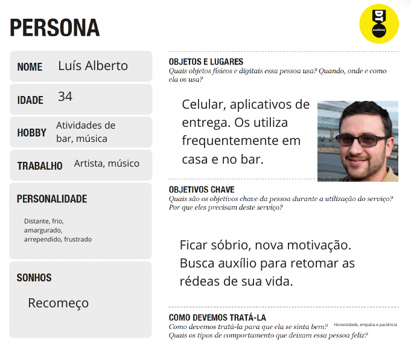
> 
>
>
> **Exemplo de Proposta de Valor**
> 
> 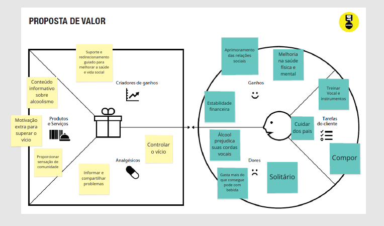
>
> 
>
>
> **Exemplo de Persona 2**
> 
> 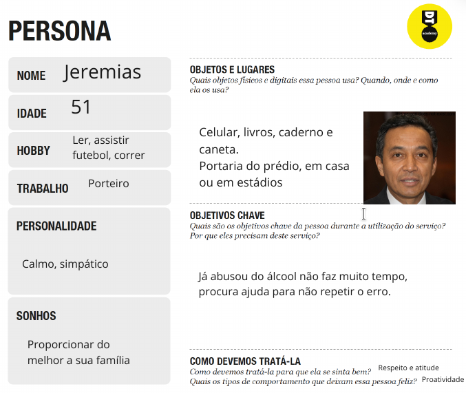
>
>
>
> **Exemplo de Proposta de Valor 2**
> 
> 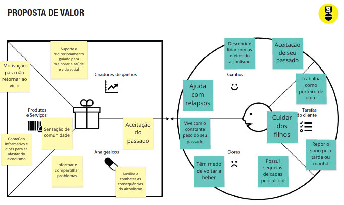

## Histórias de Usuários

Com base na análise das personas forma identificadas as seguintes histórias de usuários:

|EU COMO... `PERSONA`| QUERO/PRECISO ... `FUNCIONALIDADE` |PARA ... `MOTIVO/VALOR`                 |
|--------------------|------------------------------------|----------------------------------------|
|Luís Alberto        | Ficar sóbrio para compor           | É sua fonte de renda principal         |
|Luís Alberto        | Encontrar boas companhias          | Não se sentir solitário                |
|Luís Alberto        | Encontra motivação                 | Para recomeçar sua vida                |
|Jeremias            | Motivação contra beber álcool      | Para não ter relapsos                  |
|Jeremias            | Conhecer os efeitos do álcool      | Para melhorar sua saúde                |
|Jeremias            | Aceitar o passado alcoólatra       | Para superar seu trauma                |

## Requisitos

As tabelas que se seguem apresentam os requisitos funcionais e não funcionais que detalham o escopo do projeto:

### Requisitos Funcionais

|ID    | Descrição do Requisito  | Prioridade |
|------|-----------------------------------------|----|
|RF-001| O site deve apresentar na página principal notícias, artigos e matérias dinâmicas sobre alcoolismo obtidas por meio de canais de notícias da Internet (API) | ALTA | 
|RF-002| O site deve apresentar, para cada artigo, notícia ou matéria, uma imagem correspondente ao assunto apresentado (thumbnail)   | MÉDIA |
|RF-003| O site deve permitir ao usuário visualizar o texto completo da notícia, matéria ou artigo com todos os detalhes da publicação   | MÉDIA |
|RF-004| O site deve permitir visualizar as informações de contatos do mantenedor do site  | BAIXA |
|RF-005| O site deve permitir que usuários possam comentar em algum fórum a ser criado   | MÉDIA |
|RF-006| O site deve possuir opção de criar conta   | ALTA |
|RF-007| O site deve possuir relatos dos usuários   | MEDIA |
|RF-008| O site deve possuir um contador relacionado à quantidade de dias sóbrios | ALTA |
|RF-009| O site deve fornecer informações benéficas conforme o contador previamente citado aumenta  | ALTA |
|RF-010| O site deve apresentar um ranking conforme o contador aumenta | BAIXA |

### Requisitos não Funcionais

|ID     | Descrição do Requisito  |Prioridade |
|-------|-------------------------|----|
|RNF-001| O sistema deve ser responsivo para rodar em um dispositivos móvel | ALTA | 
|RNF-002| Deve processar requisições do usuário em no máximo 3s |  BAIXA | 
|RNF-003| O site deve ser publicado em um ambiente acessívelpublicamente na Internet (Repl.it, GitHub Pages, Heroku); |  ALTA | 
|RNF-004| O site deve ter bom nível de contraste entre os elementos datela em conformidade |  MEDIA | 
|RNF-005| Deve apresentar compatibilidade com os navegadores populares do mercado |  ALTA | 

## Restrições

O projeto está restrito pelos itens apresentados na tabela a seguir.

|ID| Restrição                                             |
|--|-------------------------------------------------------|
|01| O projeto deverá ser entregue até o final do semestre |
|02| Não pode ser desenvolvido um módulo de backend        |
|03| A equipe não pode subcontratar o desenvolvimento do trabalho.|
|04| O site deverá focar em qualidade das notícias, artigos e matérias, não em quantidade|

# Projeto de Interface

Dentre as preocupações para a montagem da interface do sistema, estamos estabelecendo foco em questões como agilidade, acessibilidade e usabilidade. Desta forma, o projeto tem uma identidade visual padronizada em todas as telas que são projetadas para funcionamento em desktops e dispositivos móveis.

## User Flow

> 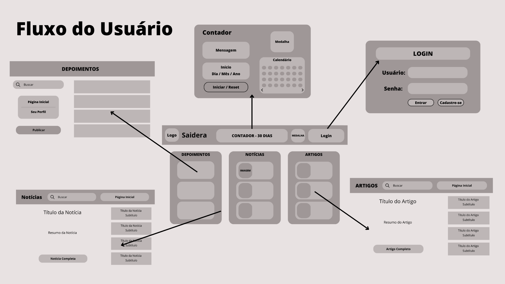
> 
>
>

## Wireframes

 À fim de exemplificar as telas do sistema proposto do trabalho, observa-se a base seguida para todas as outras telas. Nela, existem dois espaços principais: Cabeçalho e conteúdo. O último é dividido em três espaços.
 -Cabeçalho:
  Local onde será gerenciado o processo de contas, assim como outras funções e o logo do site.
 -Conteúdo:
  Local onde serão apresentadas as notícias, artigos e depoimentos disponibilizadas, assim como outras funcionalidades.
>
 **Wireframe Base**
>
> 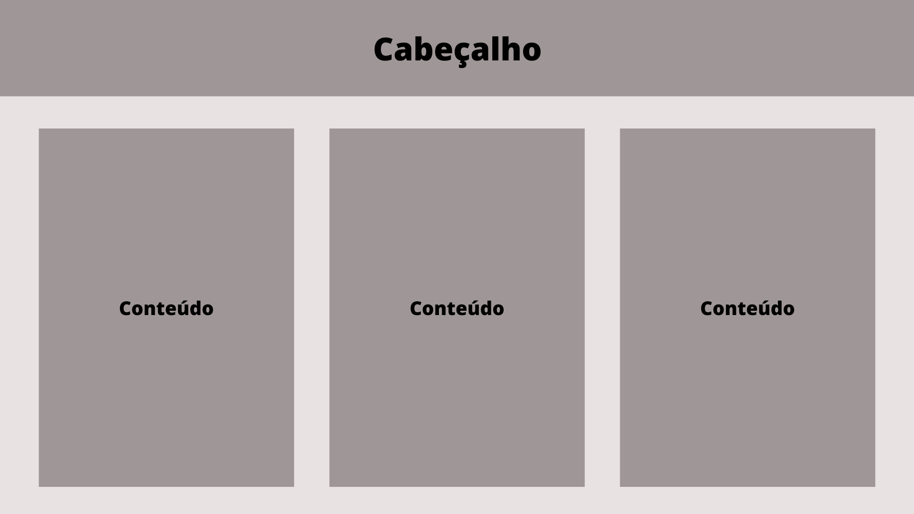
>
>
>------------------------------------------------------------------------------
 **Tela inicial - Home Page**
 >
 A tela inicial será responsável por apresentar a maior parte do conteúdo do site, de maneira limpa, sem obstruir o design. Traz consigo as notícias, depoimentos e artigos sobre alcoolismo na aba do topo. No centro, estará localizado algumas informações extras do projeto. 
>
> 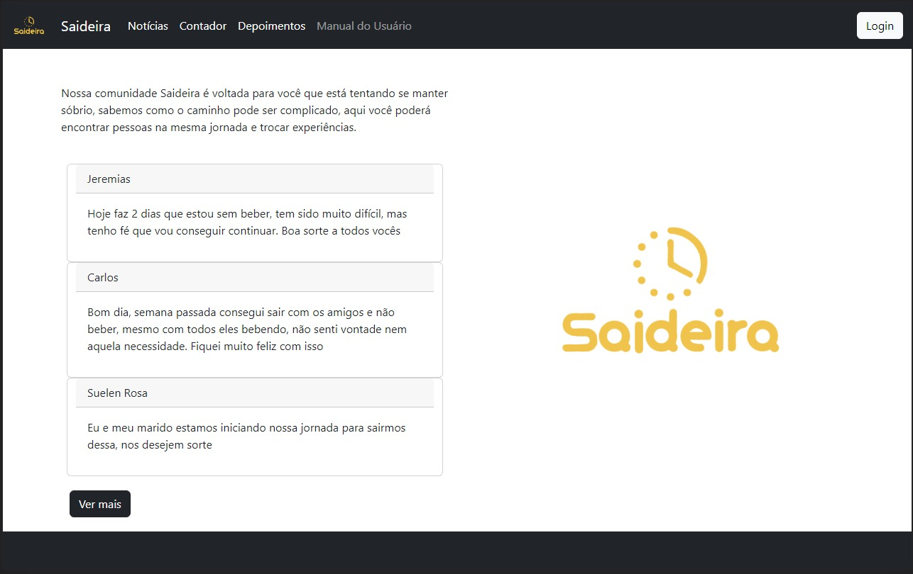
>
>
>
 **Tela Cadastro - Cadastro Conta**
>
 Essa tela disponibilizará a oportunidade (não obrigatória) de um usuário criar sua conta no sistema, à fim de se relacionar com outras funcionalidades do sistema.
>
> 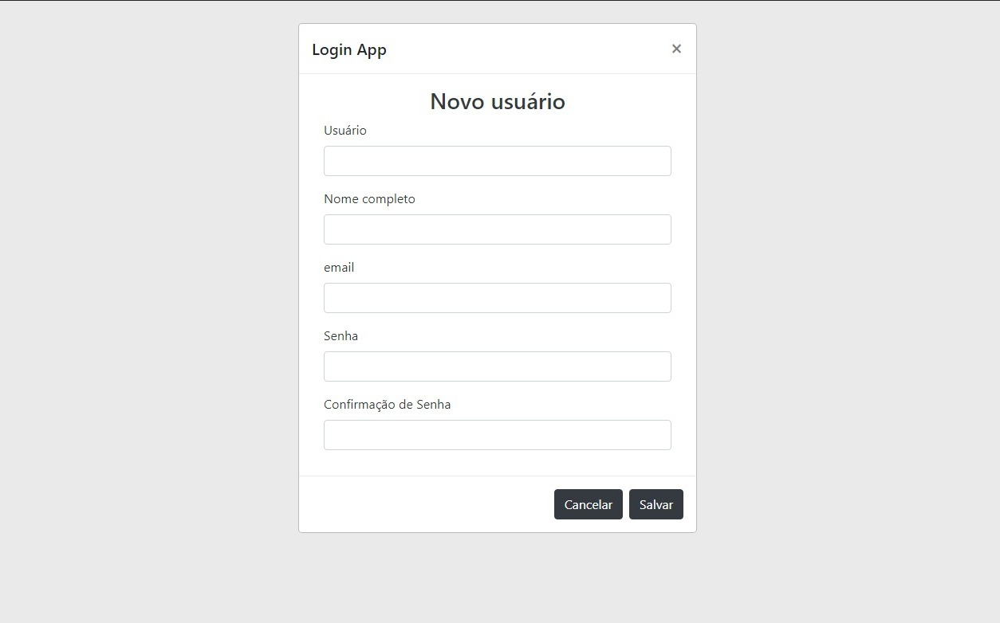
>
>
>
  **Tela Login - Login Conta**
>
 Essa tela será responsável por lidar com a ingressão do cliente com sua conta previamente registrada.
>
> 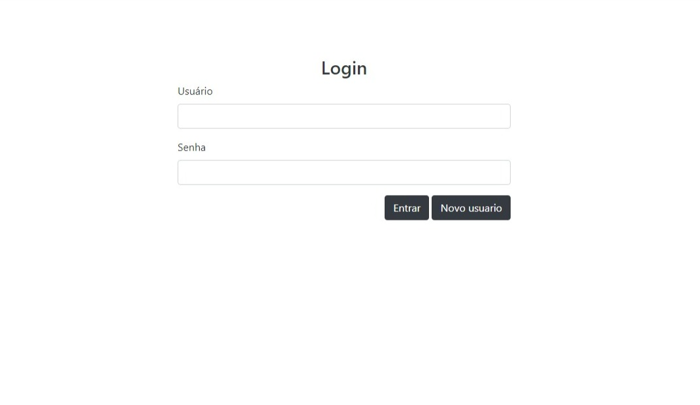
>
>
>
 **Tela Depoimentos**
>
 Essa tela apresentará no formato popular de fórum uma sessão de comentários onde usuários podem compartilhar experiências.
>
> 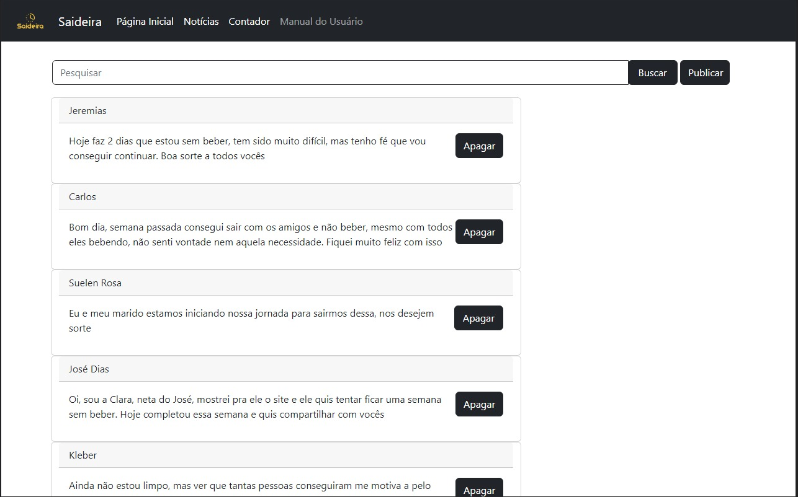
>
>
>
>
>
 **Tela Notícias**
 >
 Essa tela apresentará uma seleção vasta de notícias que cobrirão tudo que envolve o álcool, focando em seus malefícios.
>
> 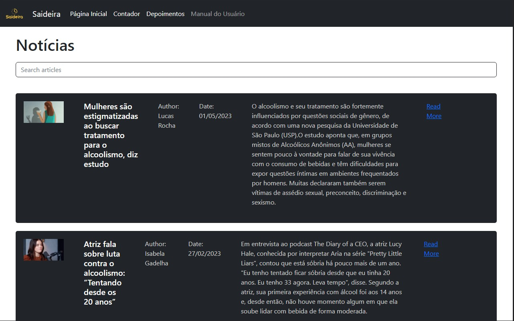
>
>
>
>
**Tela Contador**
 >
 A tela do contador representará diversas coisas diferentes para o projeto, sendo talvez a peça chave. Ele acompanhará a quantidade de tempo que uma pessoa permanece sóbria.
>
> 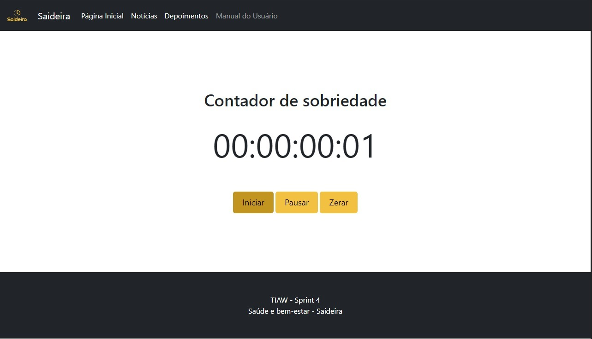
>
>
>
**Tela Manual**
 >
 A tela do manual se responsabilizará por detalhar os funcionamentos do site e funcionar como guia para aqueles que necessitarem.
>
> 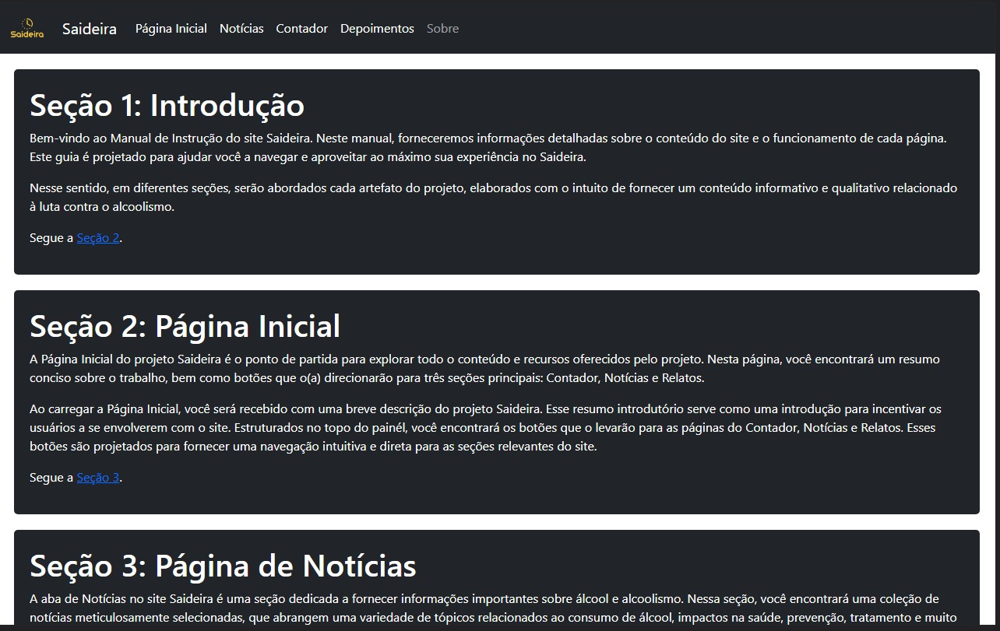
>
>

# Metodologia

A metodologia contempla as definições de ferramental utilizado pela equipe tanto para a
manutenção dos códigos e demais artefatos quanto para a organização do time na
execução das tarefas do projeto.

## Divisão de Papéis

A equipe utiliza metodologias ágeis, tendo escolhido o Scrum como base para definição do
processo de desenvolvimento.

A equipe está organizada da seguinte maneira:

● Scrum Master: Lucas Pereira

● Product Owner: Rommel

● Equipe de Desenvolvimento
○ Arthur 
○ Larissa Mariella 

## Ferramentas

| Ambiente  | Plataforma              |Link de Acesso |
|-----------|-------------------------|---------------|
|Processo de Design Thinkgin  | Miro |  https://miro.com/app/board/uXjVMYDTJeQ=/ | 
|Repositório de código | GitHub | https://github.com/ICEI-PUC-Minas-PPLCC-TI/ti-1-ppl-cc-m-20231-saideira| 
|Hospedagem do site | Replit | (https://ti-sprint4.larissamariella.repl.co/) | 
|Protótipo Interativo | MavelApp ou Figma | https://figma.com/ | 
|Editor de código | VisualStudio Code | https://code.visualstudio.com/ | 
|Editor de wireframes | Canva | https://www.canva.com/design/DAFgLocvCjQ/mFPC021h0gsWPLVWjpMeSg/edit?utm_content=DAFgLocvCjQ&utm_campaign=designshare&utm_medium=link2&utm_source=sharebutton |

## Controle de Versão

 Após obter um erro durante a realização do projeto, a versão estável e testada foi trocada de nome, substituindo a branch "master". Conforme a familiaridade com o software aumenta, novas vertentes de diferentes versões serão desenvolvidas, à fim de selecionar as tendênciais mais eficazes.
 
 
 

# Projeto da Solução

 À fim de levar aos usuários uma experiência agradável na batalha contra o vício, o nosso site contará com diversos artefatos elaborados de maneira a garantir a disseminação de informação, suporte do cliente e apoio em forma de comunidade. Tais são representados, respectivamente, pelas páginas principais do Saideira, o painél de notícias, a página do contador e a aba de relatos.
 
 Na aba de notícias, serão exibidas matérias, reportagens e outros textos relacionados a álcool e o vício. As matérias apresentadas contêm um resumo de cada notícia e há a possibilidade de se redirecionar ao link original da matéria.
 
 Seguindo, o contador representa uma forma simples e prática de oferecer apoio e incentivo para continuar livre de bebidas alcoolicas. Nessa parte do site, será apresentado um cronômetro que anota o tempo de sobriedade do usuário, assim como mensagens de incentivo e de caráter informativo, citando os benefícios
a curto e longo prazo que tal ação está tendo no seu organismo.

 Por fim, a págiina de relatos traz um ambiente de comunidade e fórum para os usuários do Saideira, aonde poderão ser debatidas experiências pessoais e diferentes perspectivas. Dessa forma, a contribuição também poderá ser realizada através da comunicação.

## Tecnologias Utilizadas

 Dadas as especificações do projeto, dentre as tecnologias existentes, o grupo trabalhou com diversos recursos diferentes. Cita-se a principal IDE Visual Studio Code, as linguagens Javascript, HTML e CSS e diferentes ferramentas gráficas da internet.

# Referências

| (https://github.com/rommelcarneiro/tiaw-template-2022) | 
>
>
>
